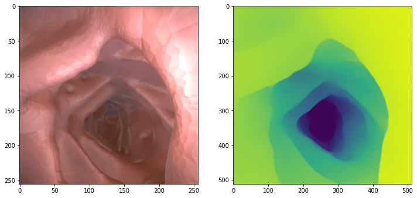
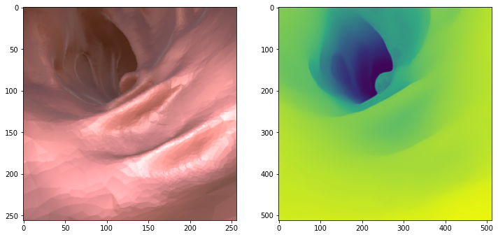
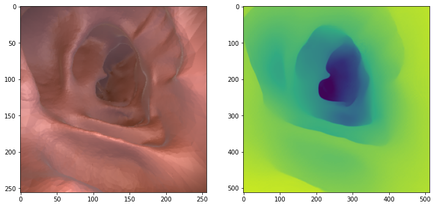
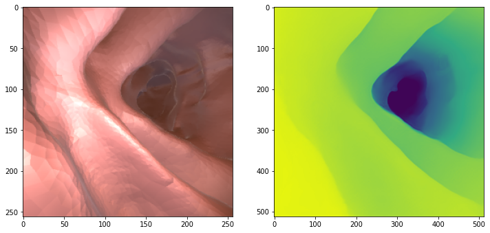

# Clone file code


```python
!git clone https://github.com/nguyenbim/Depth-Estimation-For-Colonoscopy-using-deep-learning-and-self-supervised-learning.git
```


```python
%cd Depth-Estimation-For-Colonoscopy-using-deep-learning-and-self-supervised-learning/
!mkdir checkpoints/colon2depth_512p/
```


# Install library


```python
!pip install dominate
```


# Dowload model

### Nếu lỗi khi bạn chạy trên colab là do section chưa load xong, check đường dẫn folder "/content/CV_Vinbigdata/checkpoints/colon2depth_512p" và chạy lại


```python
!gdown 1-jk4ddBheo1X3t12vKCPBxxubaOUO8S_  -O /content/Depth-Estimation-For-Colonoscopy-using-deep-learning-and-self-supervised-learning/checkpoints/colon2depth_512p/80_net_D.pth
!gdown 13HXlby3-u9JQilWNnPWUSLnLJsoRNCxH  -O /content/Depth-Estimation-For-Colonoscopy-using-deep-learning-and-self-supervised-learning/checkpoints/colon2depth_512p/80_net_G.pth
```


# Run test


### Data sample in folder "/content/CV_Vinbigdata/data_sample"
### Predict result in folder "/content/CV_Vinbigdata/data_sample/data_sample"


```python
!python ustc_test.py --name colon2depth_512p --no_instance --label_nc 0 --which_epoch 80
```

```python
import glob
import cv2
import matplotlib.pyplot as plt
data_test = glob.glob('./data_sample/*.png')
len(data_test)
```


```python

for i in data_test:
  predict_path = i.replace("data_sample","data_sample/data_sample")
  img = cv2.imread(i)
  predict_img = cv2.imread(predict_path)
  plt.figure(figsize=(12, 12))
  plt.subplot(1, 2, 1)
  plt.imshow(cv2.cvtColor(img, cv2.COLOR_BGR2RGB))
  plt.subplot(1,2,2)
  plt.imshow(cv2.cvtColor(predict_img, cv2.COLOR_BGR2RGB))
  plt.show()
```


    

    


    

    


    

    


    

    


## Acknowledgments
This project is done by 5-mem group.
This code borrows from [Self-Supervised-Depth-Estimation-for-Colonoscopy](https://github.com/ckLibra/Self-Supervised-Depth-Estimation-for-Colonoscopy.git).


## REFERENCE
[1] Cheng, K., Ma, Y., Sun, B., Li, Y., & Chen, X. (2021). Depth Estimation for Colonoscopy Images with Self-supervised Learning from Videos. Medical Image Computing And Computer Assisted Intervention – MICCAI 2021, 119-128. doi: 10.1007/978-3-030-87231-1_12.

[2] Shao, S., Pei, Z., Chen, W., Zhu, W., Wu, X., Sun, D., & Zhang, B. (2021). Self-Supervised Monocular Depth and Ego-Motion Estimation in Endoscopy: Appearance Flow to the Rescue. Retrieved 28 September 2022, from https://arxiv.org/abs/2112.08122.

[3] Liu, X., Sinha, A., Ishii, M., Hager, G., Reiter, A., Taylor, R., & Unberath, M. (2019). Dense Depth Estimation in Monocular Endoscopy with Self-supervised Learning Methods. Retrieved 28 September 2022, from https://arxiv.org/abs/1902.07766.

[4] Patel, Dhara & Upadhyay, Saurabh. (2013). Optical Flow Measurement using Lucas Kanade Method. International Journal of Computer Applications. 61. 6-10. 10.5120/9962-4611.

[5] Sun, D., Yang, X., Liu, M., & Kautz, J. (2017). PWC-Net: CNNs for Optical Flow Using Pyramid, Warping, and Cost Volume. Retrieved 28 September 2022, from https://arxiv.org/abs/1709.02371

[6] Rau, A., Edwards, P.E., Ahmad, O.F., Riordan, P., Janatka, M., Lovat, L.B., Stoyanov, D.: Implicit domain adaptation with conditional generative adversarial networks for depth prediction in endoscopy. Int. J. Comput. Assist. Radiol. Surg. 14(7), 1167–1176 (2019). https://doi.org/10.1007/s11548-019-01962-w
